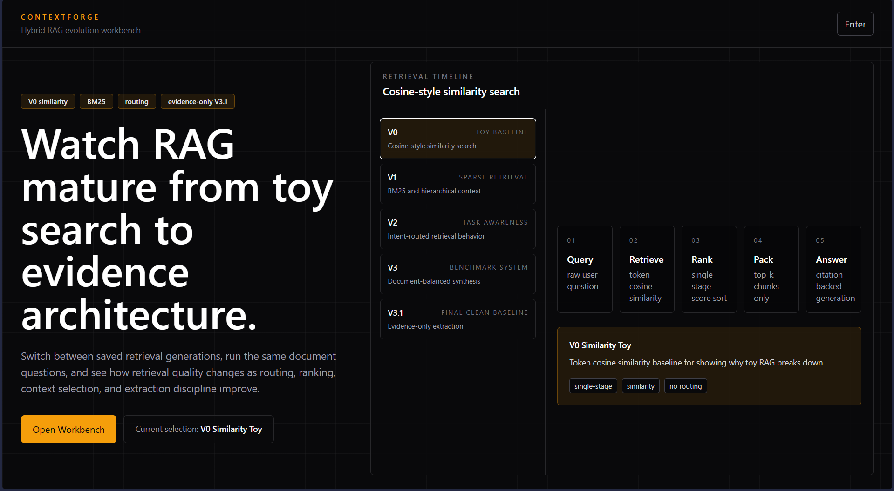

# ContextForge



Config-aware RAG workbench for comparing retrieval architectures over the same uploaded corpus.

## What It Does

ContextForge is built to answer one practical question:

How does answer quality change as retrieval matures from toy search to evidence-first retrieval?

The app lets you:

- upload a fixed document set
- switch between `v0`, `v1`, `v2`, `v3`, and `v3.1`
- run the same questions against each retrieval version
- inspect citations, retrieval traces, and answer behavior
- compare deterministic benchmark outputs against Ollama-generated outputs

## Current Baseline

The current frozen baseline is **V3.1**.

Version summary:

- `V0` - similarity toy baseline
- `V1` - sparse BM25/hierarchical baseline
- `V2` - routed retrieval milestone
- `V3` - benchmark-style production baseline
- `V3.1` - clean evidence-first baseline

See:

- [V1_BASELINE.md](./V1_BASELINE.md)
- [V2_BASELINE.md](./V2_BASELINE.md)
- [V3_BASELINE.md](./V3_BASELINE.md)
- [V3_1_BASELINE.md](./V3_1_BASELINE.md)
- [V4_FUTURE.md](./V4_FUTURE.md)

## Stack

Frontend:

- React
- Vite
- Tailwind-style utility classes

Backend:

- FastAPI
- SQLite
- local file storage
- versioned retrieval pipeline modules in `backend/pipeline/`

Generation:

- deterministic benchmark path
- Ollama generation path

Auth and billing:

- Google sign-in
- Razorpay hourly access

## Local Run

Backend:

```powershell
cd backend
pip install -r requirements.txt
uvicorn main:app --reload --host 127.0.0.1 --port 8000
```

Frontend:

```powershell
npm install
npm run dev
```

Default frontend URL:

```text
http://localhost:5173/context-forge/
```

The app is mounted at `/context-forge/`. Unrelated routes such as `/admin` should not render the app.

## Configuration

The backend reads active settings from `backend/.env`.

Typical values:

```text
CONFIG_FILE=config.json
OLLAMA_MODEL_ALLOWLIST=qwen3:4b-instruct
FRONTEND_BASE_PATH=/context-forge
API_BASE_URL=
API_PREFIX=/context-forge/api
STORAGE_BASE_DIR=data/chats
AUTH_SESSION_SECONDS=3600
ADMIN_EMAILS=ansonsaju007@gmail.com
MAX_ACTIVE_CLIENTS=1
MAX_UPLOAD_FILES=5
VRAM_AVAILABLE_GB=6
VRAM_REQUIRED_GB=4
```

Important notes:

- `OLLAMA_MODEL_ALLOWLIST` filters the model dropdown. If empty, all available backend-discovered models are shown.
- `FRONTEND_BASE_PATH` controls where the app is mounted.
- `STORAGE_BASE_DIR=data/chats` keeps local document/chat paths short.
- `AUTH_SESSION_SECONDS=3600` sets the one-hour usage window.
- `MAX_ACTIVE_CLIENTS=1` allows only one active Ollama generation at a time.
- `MAX_UPLOAD_FILES=5` limits each workspace to five uploaded documents.
- `VRAM_AVAILABLE_GB` and `VRAM_REQUIRED_GB` are hardcoded deployment values used to block generation when configured VRAM is insufficient.

Saved config snapshots:

- `config.v1.json`
- `config.v2.json`
- `config.v3.json`
- `config.v3.1.json`

## Secrets, Auth, and Payment

`backend/secrets.env` is gitignored and acts as the production switch.

### If `backend/secrets.env` does not exist

- local mode
- no auth wall
- no payment gate

### If `backend/secrets.env` exists

- Google auth can be enabled
- Razorpay payments can be enabled
- usage is tracked in SQLite

Create it from `backend/secrets.env.example`:

```text
GOOGLE_CLIENT_ID=your-google-oauth-web-client-id.apps.googleusercontent.com
JWT_SECRET=your-long-random-secret
RAZORPAY_KEY_ID=rzp_live_or_test_key_id
RAZORPAY_KEY_SECRET=rzp_live_or_test_secret
RAZORPAY_AMOUNT_PAISE=2000
RAZORPAY_CURRENCY=INR
```

Notes:

- `GOOGLE_ALLOWED_DOMAIN` is optional. Leave it blank or omit it if you do not want domain restriction.
- `RAZORPAY_AMOUNT_PAISE=2000` means `Rs 20` for one paid hour.
- `JWT_SECRET` should live in `backend/secrets.env` for production.

## Access Model

Current access behavior:

- first successful user login gets `1 hour free`
- after that, payment extends access by `1 hour`
- admin emails listed in `ADMIN_EMAILS` get unlimited usage

The frontend shows the current usage state in the header:

- local
- unlimited
- payment
- countdown such as `59:42`

## Usage Tracking

Usage is stored server-side in:

```text
data/contextforge.db
```

Tracked fields include:

- user identity
- free-grant status
- entitlement expiry
- payment count
- total payment amount
- query count
- ingest count
- uploaded chunk count
- usage events

The timer uses an absolute expiry timestamp, so entitlement remains correct across refreshes, reconnects, and backend restarts.

## Storage

Important runtime paths:

- `data/chats/` - local chat/document storage
- `data/contextforge.db` - SQLite auth/usage database
- `backend/reports/` - smoke reports and benchmark runs

These are gitignored.

## API

Current core endpoints:

- `GET /context-forge/api/health`
- `GET /context-forge/api/config`
- `GET /context-forge/api/capabilities`
- `GET /context-forge/api/models`
- `GET /context-forge/api/rag-versions`
- `POST /context-forge/api/auth/google`
- `GET /context-forge/api/auth/me`
- `GET /context-forge/api/usage/me`
- `POST /context-forge/api/payment/order`
- `POST /context-forge/api/payment/verify`
- `GET /context-forge/api/documents`
- `POST /context-forge/api/documents/clear`
- `POST /context-forge/api/ingest`
- `POST /context-forge/api/retrieve`
- `POST /context-forge/api/chat`

## Benchmarking

Run the smoke suite:

```powershell
python backend\benchmarks\smoke_queries.py
```

Run the menu-driven version comparison:

```powershell
python backend\ultimate_run.py
```

That runner is useful for:

- same question across all versions
- deterministic vs Ollama answer behavior
- source coverage and retrieval drift checks

## What This Project Is

Best description:

- retrieval systems workbench
- local RAG benchmarking tool
- evidence-aware answer generation demo
- versioned retrieval architecture comparison

Avoid describing it as:

- generic chatbot
- enterprise knowledge platform
- full multi-tenant AI system

## Deploy Notes

For deployment, the minimum practical setup is:

- frontend built with the correct mount path
- backend running with `backend/.env`
- production secrets in `backend/secrets.env`
- Ollama available with the intended model policy

For this project, the intended default generation model is:

```text
qwen3:4b-instruct
```
